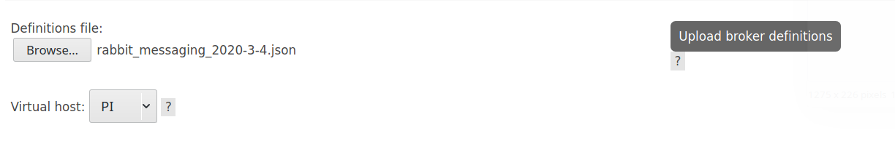

# Migrate rabbitmq configurations


1. Enabale web interface rabbitmq plugin
 ```bash
 $ sudo rabbitmq-plugins enable rabbitmq_management
 ```

2. Run rabbitmq-server

 ```bash
 $ sudo rabbitmq-server
 ```


3. Access to the [link](http://localhost:15672)
 - Username : `admin` or `guest`
 - Password : `admin` or `guest`


4. Create a Virtual host called "PI"
- Admin->Virtual hosts
- Field Name input box with "PI"
- Add virtual host

4. Import rabbitmq json configuration file **social-network-mining/databases_and_rabbit_copy/rabbitmq/rabbit_messaging_2020-3-4.json** on web interface

- Select **Overview** Tab
- Select PI as Virtual Box
- Select file
- Upload broker definitions


